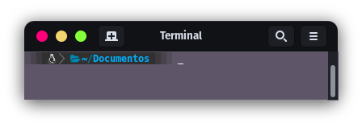
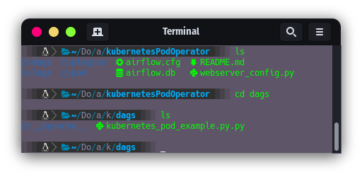
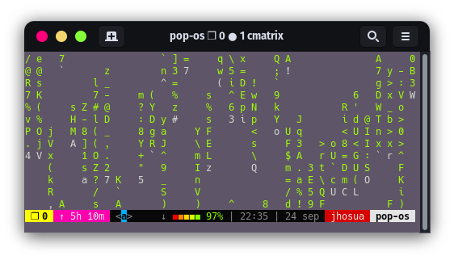
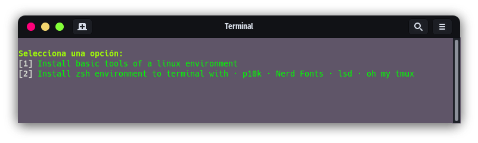
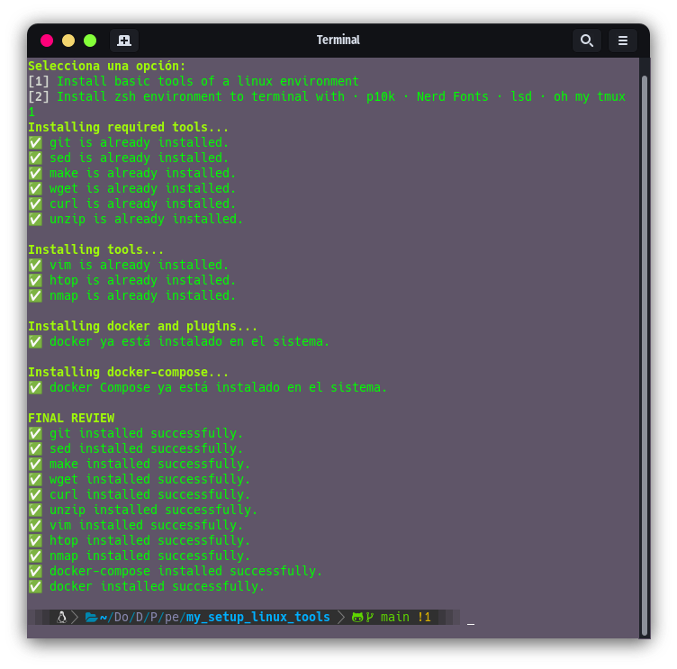

<h1 align="center"> Hikari </h1>

<p align="center">
  <a href="https://skillicons.dev">
    
  </a>
</p>

## Description
This project aims to simplify and automate the process of installing and configuring essential tools and customization themes on Ubuntu systems. Provides a script that performs the following actions:

1. **Tools Installation:** 
Automatically installs important tools such as Git, sed, make, wget, curl and unzip to improve user experience.

2. **Theme Configuration:** Facilitates system customization by installing and configuring themes, in particular the popular Powerlevel10k theme, which improves the appearance and functionality of the terminal.

## Resources

- [Nerd Fonts](https://www.nerdfonts.com/)
- [powerlevel10k](https://github.com/romkatv/powerlevel10k/tree/master)
- [lsd](https://github.com/lsd-rs/lsd)
- [Oh my tmux](https://github.com/gpakosz/.tmux)
- [Docker](https://docs.docker.com/engine/install/ubuntu/)
- [Docker compose](https://docs.docker.com/compose/install/standalone/)

<h1 align="center">New Terminal with Zsh · p10k · Nerd Fonts · lsd · oh my tmux </h1>

<div align="center">
    <a href="#--------">
        
    </a>
    <a href="#--------">
        
    </a>
</div>

<div align="center">
    <a href="#--------">
        
    </a>
</div>

## Zsh environment:

- **zsh** as default shell 
- **lsd** as ls command
- **powelevel10k** as theme of shell of the terminal
- **Hack Nerd Font** as font to terminal to visual icons
- **plugins** to experience of user with zsh terminal 

<h1 align="center"> Install basic tools of a linux environment </h1>

### Basic Tools:

- git
- vim
- htop
- nmap
- docker
- docker-compose

> **Nota:** If you already have some of these tools, they will not be installed.

## Get started

Choose an option 1 or 2

<div align="center">
    <a href="#--------">
        
    </a>
</div>

- **[ 1 ]:** installs a list of basic tools for our Linux system previously specified in [Basic Tools](https://github.com/argell10/hikari#basic-tools)

- **[ 2 ]:** install a zsh environment configured with useful zsh themes and plugins
In addition, the theme uses powerlevel10k, which gives a very aesthetic touch to our terminal and improves the user experience.

Regardless of the option you choose, a validation and finally the installation will be carried out in case the tools to be installed are not installed or configured

<div align="center">
    <a href="end_install">
        
    </a>
</div>

## Installation

> **Note:** This project should not be run as super user, it will ask for sudo permissions

1. Run the next command to install
```bash
$ git clone https://github.com/argell10/hikari-ken.git --depth=1 && cd hikari-ken && ./install.sh
```
